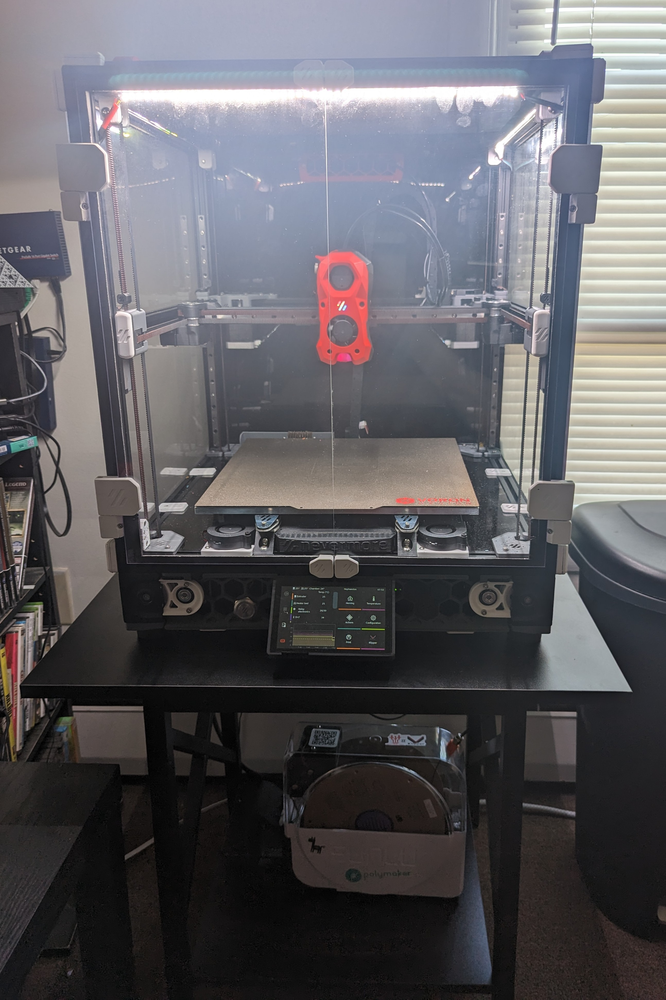

<!--
 Copyright (C) 2023 Chris Laprade (chris@rootiest.com)

 This file is part of Hephaestus.

 Hephaestus is free software: you can redistribute it and/or modify
 it under the terms of the GNU General Public License as published by
 the Free Software Foundation, either version 3 of the License, or
 (at your option) any later version.

 Hephaestus is distributed in the hope that it will be useful,
 but WITHOUT ANY WARRANTY; without even the implied warranty of
 MERCHANTABILITY or FITNESS FOR A PARTICULAR PURPOSE.  See the
 GNU General Public License for more details.

 You should have received a copy of the GNU General Public License
 along with Hephaestus.  If not, see <http://www.gnu.org/licenses/>.
-->

# Hephaestus (hephaestus)

by: [rootiest](https://github.com/rootiest)

This profile is for a Voron V2.4 300mm with TAP and a nozzle brush and a bunch of other stuff.

## Usage

To install printcfg with this profile, run:

    curl https://raw.githubusercontent.com/rootiest/printcfg/master/scripts/install.sh | bash -s -- hephaestus

To change to this profile, run:

    printcfg change hephaestus

## Features

## Features

- 300mm build volume: The printer has a build volume of 300mm.
- Voron TAP probe: The printer uses a Voron TAP probe for bed leveling.
- Nozzle brush: The printer has a nozzle brush attached to it.
- Nevermore Filter: The printer has a Nevermore filter installed.
- Exhaust Fan: The printer has an exhaust fan installed.
- Bed fans: The printer has bed fans installed.
- Chamber sensor: The printer has a chamber sensor installed.
- Filament sensor on toolhead (load detection possible): The printer has a filament sensor installed on the toolhead that can detect when filament is loaded.
- Door sensor: The printer has a door sensor installed.
- Case lights (125 RGBW LEDs): The printer has 125 RGBW LEDs installed for lighting.
- StealthBurner LEDs (rainbow barf + RGBW LEDs): The printer has StealthBurner LEDs installed.
- Beeper (for notifications): The printer has a beeper installed for notifications.
- Sensorless homing: The printer uses sensorless homing.
- Adaptive meshing: The printer uses adaptive meshing.

## Notes

This is what I use on my personal machine.

## Photos

